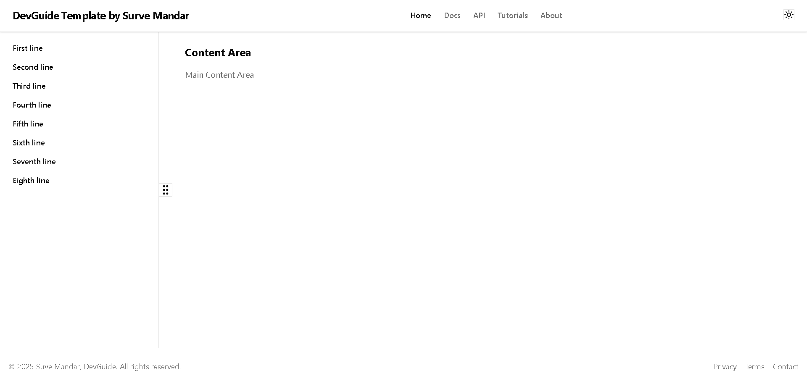

# 🧠 Developer-Hub

A modern developer dashboard built with **Next.js**, **Tailwind CSS**, and **shadcn/ui** – designed to be fast, accessible, and fully customizable. Manage your tools, docs, and personal workflows in one elegant interface.


## Preview of the project



---

## 🚀 Tech Stack

- [Next.js](https://nextjs.org/) – React framework for production
- [Tailwind CSS](https://tailwindcss.com/) – Utility-first CSS for rapid UI development
- [shadcn/ui](https://ui.shadcn.com/) – Beautifully crafted components
- [TypeScript](https://www.typescriptlang.org/) – Strongly typed React code
- [Lucide Icons](https://lucide.dev/) – Icon set used for UI actions
- [next-themes](https://github.com/pacocoursey/next-themes) – Theme toggling (light/dark/system)

---

## 📂 Project Structure

/app # App directory (Next.js 13+) /components # Shared UI components /styles # Global styles (Tailwind + custom vars) /pages # Routing (if using pages dir) /public # Static assets /lib # Utilities and helpers

yaml
Copy
Edit

---
## 🌗 Features

- 🔥 Dark/light theme support via `next-themes` & shadcn/ui
- ⚡ Reusable collapsible side navigation
- 🧩 Fully typed with TypeScript
- ✨ Smooth animations and transitions
- 💡 Easily extendable component-based architecture
- 🧪 Well-structured for unit/e2e testing

---

## 🛠️ Getting Started


# 1. Clone the repository
```bash
git clone https://github.com/yourusername/developer-hub.git

```
# 2. Navigate to the project folder
```bash
cd developer-hub
```
# 3. Install dependencies
```bash
npm install
```
# 4. Run the dev server
```bash
npm run dev

```
```bash
Visit http://localhost:3000 to view the app.
```
📦 Build for Production
bash
Copy
Edit
npm run build
npm run start
🔧 Customization
Tailwind config: tailwind.config.js

Theme variables: /styles/globals.css

Sidebar items: /components/SideNav.tsx

Light/dark theme toggle: /components/ModeToggle.tsx

📸 UI Preview
Include screenshots or a short GIF here

📄 License
This project is open source under the MIT License.

🙋‍♂️ Author
Built with ❤️ by Mandar Surve

